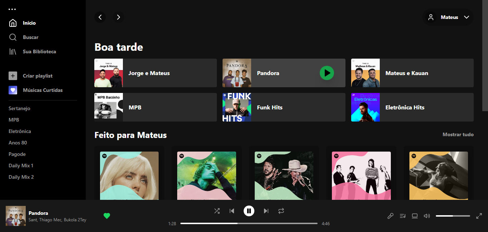

# Spotify Clone 🐜

### Projeto ⚒️
- O objetivo deste projeto é criar um clone do Spotify utilizando o framework Vue.js como ferramenta de aprendizado.

### Executando o código
- Instalando as dependencias 📚

```
>> npm install
```

- Executando o código 🚀
```
>> npm run dev
```
### Captura de tela 📸

